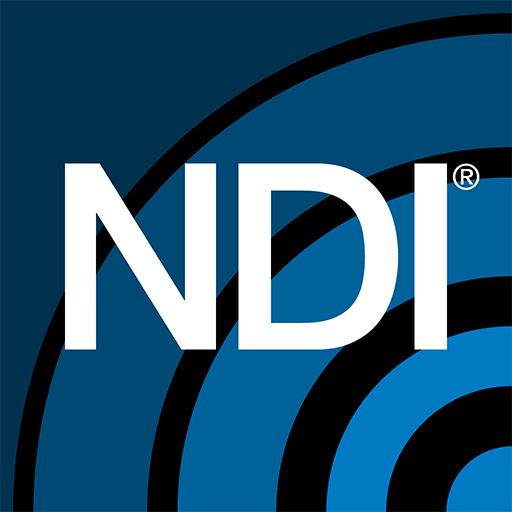

# ndirust-py: Python NDI Bindings

<div align="center">
  
  &nbsp;&nbsp;&nbsp;&nbsp;
  
  &nbsp;&nbsp;&nbsp;&nbsp;
  
</div>

<div align="center">
  <h3>High-performance Python bindings for NDI® technology using Rust</h3>
</div>

<p align="center">
  <a href="https://github.com/yourusername/ndirust-py/blob/main/LICENSE">
    
  </a>
  <a href="https://pypi.org/project/ndirust-py/">
    
  </a>
  <a href="https://github.com/yourusername/ndirust-py/actions">
    
  </a>
  
</p>

---

## Overview

ndirust-py provides Python bindings for NewTek's NDI® (Network Device Interface) technology, leveraging Rust's performance and safety. The library enables Python applications to discover, send, and receive NDI video streams with minimal overhead.

## Features

- ✅ Cross-platform NDI integration
- ✅ Source discovery on the network
- ✅ Video frame sending with customizable parameters
- ✅ Video, audio, and metadata receiving with full type support
- ✅ Ready-to-use bundled NDI runtime (Windows)
- ✅ GUI preview application with stream selection

## Requirements

- Python 3.7 or higher
- [NDI SDK](https://ndi.tv/tools/) (optional for Windows users, required for macOS/Linux)

## Installation

### Simple Installation

The package includes the necessary NDI runtime libraries for Windows, so you can simply install it with pip:

```bash
pip install ndirust-py
```

> **Platform Support Note**: Currently, the package includes bundled DLLs for Windows only. macOS and Linux users will still need to install the NDI SDK separately.

### From Source

```bash
# Clone the repository
git clone https://github.com/yourusername/ndirust-py.git
cd ndirust-py

# Install build dependencies
pip install -r requirements.txt

# Build and install the package
python build_wheel.py
pip install dist/ndirust_py-0.1.0-*.whl
```

## Examples

The repository includes several example scripts in the `examples` directory:

- `ndi_finder_example.py`: Demonstrates how to find NDI sources on the network
- `ndi_sender_example.py`: Shows how to send NDI video frames
- `ndi_receiver_example.py`: Shows how to receive and process NDI frames
- `ndi_gui_preview.py`: **GUI application** for previewing NDI video streams with source selection

### Finding NDI Sources

```python
import ndirust_py

# Initialize NDI
ndirust_py.initialize_ndi()

# Create a finder
finder = ndirust_py.discovery.NdiFinder()

# Get available sources (with 1 second timeout)
sources = finder.find_sources(timeout_ms=1000)

# Print sources
for source in sources:
    print(f"Found source: {source}")

# Clean up
finder.close()
```

### Sending NDI Video

```python
import time
import ndirust_py

# Initialize NDI
ndirust_py.initialize_ndi()

# Create an NDI sender
sender_name = "Python Test Sender"
sender = ndirust_py.sender.NdiSender(sender_name)

# Send a test pattern for 5 seconds
for i in range(150):  # 30fps * 5 seconds = 150 frames
    sender.send_test_pattern(width=1280, height=720, fps_n=30, fps_d=1)
    time.sleep(1/30)  # Sleep for approximately one frame duration

# Clean up
sender.close()
```

### Receiving NDI Video

```python
import time
import ndirust_py

# Initialize NDI
ndirust_py.initialize_ndi()

# First, find sources
finder = ndirust_py.discovery.NdiFinder()
sources = finder.find_sources(timeout_ms=3000)

if not sources:
    print("No NDI sources found!")
    finder.close()
    exit(1)

# Select the first source
source_name = str(sources[0]).replace("NdiSource(name='", "").replace("')", "")
print(f"Connecting to source: {source_name}")

# Create a receiver and connect to the source
receiver = ndirust_py.receiver.NdiReceiver()
receiver.connect_to_source(source_name)

# Receive frames for 10 seconds
start_time = time.time()
frame_count = 0

while time.time() - start_time < 10:
    # Receive a frame with 500ms timeout
    frame_type, frame = receiver.receive_frame(timeout_ms=500)
    
    # Check if we received a frame
    if frame_type == ndirust_py.receiver.FrameType.Video and frame is not None:
        frame_count += 1
        print(f"Video frame: {frame.width}x{frame.height} @ {frame.frame_rate_n}/{frame.frame_rate_d} fps")
        print(f"Format: {frame.get_four_cc_name()}")
    
    elif frame_type == ndirust_py.receiver.FrameType.Audio and frame is not None:
        print(f"Audio frame: {frame.sample_rate}Hz, {frame.num_channels} channels, {frame.num_samples} samples")
    
    elif frame_type == ndirust_py.receiver.FrameType.Metadata and frame is not None:
        print(f"Metadata: {frame.data[:50]}...")

print(f"Received {frame_count} frames in 10 seconds")

# Clean up
receiver.close()
finder.close()
```

### GUI Preview Example

The GUI preview example demonstrates a complete application that:
- Discovers NDI sources on the network
- Allows selection from available sources
- Displays the video stream in real-time
- Shows performance statistics

To run the GUI example:

```bash
# Install required dependencies
pip install pillow numpy

# Run the example
python examples/ndi_gui_preview.py
```

<div align="center">
  <p><i>GUI Preview: NDI video stream preview application with source selection</i></p>
  <p><i>(Screenshot will be added here)</i></p>
</div>

## API Documentation

### Core Functions

- `ndirust_py.get_version_info()`: Get version information about the library
- `ndirust_py.initialize_ndi()`: Initialize the NDI runtime
- `ndirust_py.is_supported_cpu()`: Check if NDI is supported on this CPU

### Discovery Module

- `ndirust_py.discovery.NdiFinder()`: Create a new NDI finder
  - `find_sources(timeout_ms)`: Find NDI sources on the network
  - `close()`: Free resources

### Sender Module

- `ndirust_py.sender.NdiSender(name)`: Create a new NDI sender
  - `send_test_pattern(width, height, fps_n, fps_d)`: Send a test pattern frame
  - `send_video_frame(data, width, height, fps_n, fps_d)`: Send custom video data
  - `close()`: Free resources

### Receiver Module

- `ndirust_py.receiver.NdiReceiver()`: Create a new NDI receiver
  - `connect_to_source(source_name)`: Connect to a specific NDI source
  - `receive_frame(timeout_ms)`: Receive a frame (returns a tuple of frame_type and frame)
  - `close()`: Free resources

- Frame Types:
  - `ndirust_py.receiver.FrameType.None`: No frame received
  - `ndirust_py.receiver.FrameType.Video`: Video frame
  - `ndirust_py.receiver.FrameType.Audio`: Audio frame
  - `ndirust_py.receiver.FrameType.Metadata`: Metadata frame
  - `ndirust_py.receiver.FrameType.Error`: Error occurred

- Video Frames (`NdiVideoFrame`):
  - Properties: `width`, `height`, `frame_rate_n`, `frame_rate_d`, `timecode`, `data_size`, `four_cc`
  - Methods: `get_data()`, `get_four_cc_name()`

- Audio Frames (`NdiAudioFrame`):
  - Properties: `sample_rate`, `num_channels`, `num_samples`, `timecode`, `data_size`
  - Methods: `get_data()`

- Metadata Frames (`NdiMetadataFrame`):
  - Properties: `timecode`, `data`

## Roadmap

The following features are planned for future releases:

- **NDI HX Support**: Integration with NDI High Efficiency codec for compressed streams
- **Standalone Monitor Application**: Enhanced version of the GUI preview as a standalone tool
- **macOS and Linux DLL Bundling**: Include runtime libraries for all major platforms
- **Advanced Audio Features**: Better control over audio channel mapping and processing
- **Custom Metadata API**: Simplified interface for working with NDI metadata
- **Performance Optimizations**: Further Rust optimizations for resource-intensive operations

## Contributing

Contributions are welcome! Please feel free to submit a Pull Request.

1. Fork the repository
2. Create your feature branch (`git checkout -b feature/amazing-feature`)
3. Commit your changes (`git commit -m 'Add some amazing feature'`)
4. Push to the branch (`git push origin feature/amazing-feature`)
5. Open a Pull Request

## License

This project is licensed under the MIT License - see the [LICENSE](LICENSE) file for details.

## Acknowledgements

- [NewTek NDI®](https://ndi.tv/) is a registered trademark of NewTek, Inc.
- [ndi crate](https://docs.rs/ndi/latest/ndi/) provides the underlying Rust bindings
- [PyO3](https://pyo3.rs) enables the Rust to Python bindings 